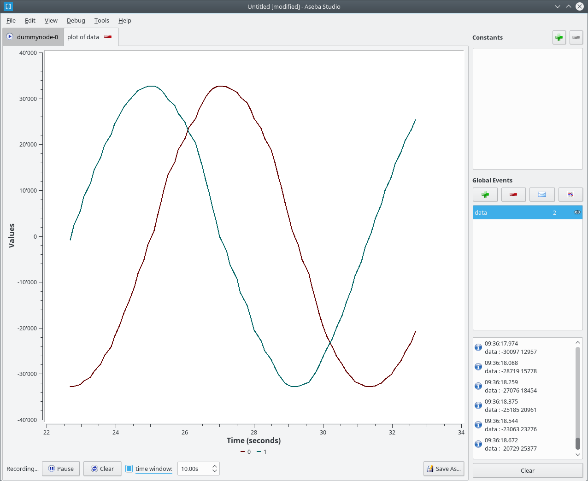
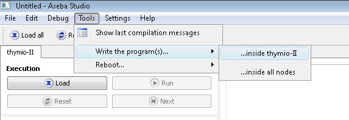
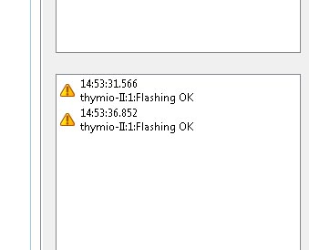

Aseba Studio
============

Aseba Studio is an integrated development environment within which we
edit and debug the programs of all nodes of an Aseba network.

The environment
---------------

Concurrent editing
~~~~~~~~~~~~~~~~~~

Within Studio, each node of an Aseba network has its own tab with its
program, memory content, execution status, and debugging commands. In
addition, a toolbar provides general commands which affect all the
nodes. This allows both an overall control of the network and a specific
control of each node.

Powerful editor
~~~~~~~~~~~~~~~

The program editor provides syntax highlighting, indentation of blocks,
and dragging of variables' names from memory. It also shows the current
position of execution in step by step mode and colours errors in red.

Instant compilation
~~~~~~~~~~~~~~~~~~~

Studio recompiles the program while the developer is typing it. The
result of compilation (success or a description of the error) is
displayed below the editor. This permits the correction of errors as
soon as they appear, which increases the quality of the code.

Data inspection
~~~~~~~~~~~~~~~

Studio lists the variables available on each node with their values. We
can update this list in a single click. This list provides a quick
overview of the state of the node.

Debugger
~~~~~~~~

Studio has an integrated debugger; for each node, it gives the current
execution status. It supports continuous execution, step by step, and
breakpoints. A right click inside the program editor allows to set or
clear a breakpoint on a specific line. After a breakpoint or a step, the
values of the variables are updated.

Constants definition
~~~~~~~~~~~~~~~~~~~~~

We can define constants which are available on all the nodes. Constants
can be re-ordered by drag and drop.

Network-wide events
~~~~~~~~~~~~~~~~~~~

We can specify the names of the events, and by double-clicking on a
name, we can send the corresponding event. A right-click on an event
allows to plot this event over time. Events can be re-ordered by
drag and drop.

Below the list of event names, a log shows the recent events along with
their time stamps and parameters. This allows the monitoring of the
distributed behaviour in the network.

Local events, native functions and plugins
~~~~~~~~~~~~~~~~~~~~~~~~~~~~~~~~~~~~~~~~~~~

Studio shows the local events available on each node. It also lists its
native functions. The tool-tip of each function gives a short
documentation. A list of node-specific plugins is also provided, if any.

Event plotting in Aseba Studio
------------------------------

Aseba Studio allows the data of global events to be plotted over time.
To do so, in a node tab, right click on a global event and select "Plot
event data". This creates a new tab with a 2D plot of the event data
over time:

The y-axis scales automatically. The x-axis spans the whole duration of
event data recording, with a maximum of *time window* if the latter is
set. The recording can be started and stopped, and the data can be
cleared. At the bottom-right part of the tab, a *Save As* button allows
the event data to be saved in a text file. Each line will contain a
timestamp and the values of the event data, separated by a space.

Flashing user code in Thymio
----------------------------

It is possible to save a user code in Thymio II so that, even when
turned off, Thymio keeps the code. The saved behaviour will be
accessible through the menu, the colour of your code is "colourless".
Once this code is launched, the user cannot go back in the selection
menu unless the robot is restarted.

To save the code in Thymio II
~~~~~~~~~~~~~~~~~~~~~~~~~~~~~

-  Load the code, **without running it**.
-  Click on "Tools" -> "Write the program(s) …" -> "… inside Thymio-II".
-  Check in the window of the event if "Flashing OK" appears.

Tips
----

Save time
~~~~~~~~~~~~

You can drag the names of variables, native functions, events, and
constants and thus save typing.

Get help
~~~~~~~~~

The ``Help`` menu of Studio gives instant access to this documentation
and to the documentation of the Aseba programming language.
