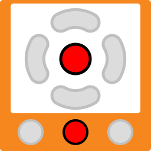

Simulated Thymio API
====================

This page describe the APIs, methods and VPL blocks available when programming a simulated Thymio.
Because the simulated Thymio is in a limited, virtual environment, not all features are implemented.
However, in order to be compatible with the real Thymio, all variables, functions and events are available.

If you use them, you will not get a compilation error, however some events might never happen,
some functions might do nothing and some variables might never change.

Aseba
-----

Variables
~~~~~~~~~

+-------------------------------------------------------------------------------------------------+------------------------------------------------------------------------------------------------------------------------------------------------+
| Variable                                                                                        | Status                                                                                                                                         |
+=================================================================================================+================================================================================================================================================+
| ``button.backward``, ``button.left``, ``button.center``, ``button.forward``, ``button.right``   | simulated, 0 by default, 1 when the respective buttons are clicked on with the mouse                                                           |
+-------------------------------------------------------------------------------------------------+------------------------------------------------------------------------------------------------------------------------------------------------+
| ``prox.horizontal[0-6]``                                                                        | simulated, return values depending on what is around the robot in the simulator with the addition of noise                                     |
+-------------------------------------------------------------------------------------------------+------------------------------------------------------------------------------------------------------------------------------------------------+
| ``prox.ground.ambiant[0-1]``                                                                    | **always 0**                                                                                                                                   |
+-------------------------------------------------------------------------------------------------+------------------------------------------------------------------------------------------------------------------------------------------------+
| ``prox.ground.reflected[0-1]``                                                                  || Simulated, return values depending on the colour of the ground with the addition of noise.                                                    |
|                                                                                                 || The simulated environment is 2-dimensional, there can be no holes under Thymio and Thymio cannot be tilted or laid on one side)               |
+-------------------------------------------------------------------------------------------------+------------------------------------------------------------------------------------------------------------------------------------------------+
| ``prox.ground.delta[0-1]``                                                                      | simulated, returns the same as ``prox.ground.reflected[0-1]``                                                                                  |
+-------------------------------------------------------------------------------------------------+------------------------------------------------------------------------------------------------------------------------------------------------+
| ``prox.comm.rx``, ``prox.comm.tx``                                                              | **always 0**                                                                                                                                   |
+-------------------------------------------------------------------------------------------------+------------------------------------------------------------------------------------------------------------------------------------------------+
| ``acc[0-2]``                                                                                    | **always 0**                                                                                                                                   |
+-------------------------------------------------------------------------------------------------+------------------------------------------------------------------------------------------------------------------------------------------------+
| ``temperature``                                                                                 | **always 220**                                                                                                                                 |
+-------------------------------------------------------------------------------------------------+------------------------------------------------------------------------------------------------------------------------------------------------+
| ``motor.left.target``, ``motor.right.target``                                                   | default 0, can be defined by the user to set the motors' speeds. The simulated Thymio can move on a plane.                                     |
+-------------------------------------------------------------------------------------------------+------------------------------------------------------------------------------------------------------------------------------------------------+
| ``motor.left.speed``, ``motor.right.speed``                                                     | returns ``motor.left.target``, ``motor.right.target``                                                                                          |
+-------------------------------------------------------------------------------------------------+------------------------------------------------------------------------------------------------------------------------------------------------+
| ``motor.left.pwm``, ``motor.right.pwm``                                                         | **always 0**                                                                                                                                   |
+-------------------------------------------------------------------------------------------------+------------------------------------------------------------------------------------------------------------------------------------------------+
| ``rc5.address``                                                                                 | **always 0**                                                                                                                                   |
+-------------------------------------------------------------------------------------------------+------------------------------------------------------------------------------------------------------------------------------------------------+
| ``rc5.command``                                                                                 | **always 0**                                                                                                                                   |
+-------------------------------------------------------------------------------------------------+------------------------------------------------------------------------------------------------------------------------------------------------+
| ``mic.intensity``                                                                               | **always 0**                                                                                                                                   |
+-------------------------------------------------------------------------------------------------+------------------------------------------------------------------------------------------------------------------------------------------------+
| ``mic.threshold``                                                                               | **can be defined by the user but will have no effect**                                                                                         |
+-------------------------------------------------------------------------------------------------+------------------------------------------------------------------------------------------------------------------------------------------------+
| ``timer.period[0]``, ``timer.period[1]``                                                        | can be defined by the user to setup the ``timer0`` and ``timer1`` events                                                                       |
+-------------------------------------------------------------------------------------------------+------------------------------------------------------------------------------------------------------------------------------------------------+

Functions
~~~~~~~~~

+--------------------------------------------------------------------------------------------------+---------------------------------------------------------------+
| Function                                                                                         | Status                                                        |
+==================================================================================================+===============================================================+
|| ``prox.comm.enable(state)``                                                                     | **does nothing**                                              |
+--------------------------------------------------------------------------------------------------+---------------------------------------------------------------+
|| ``leds.circle(l0, l1, l2, l3, l4, l5, l6, l7)``                                                 | These LEDs are displayed as textures on the simulated robot   |
|| ``leds.top(r, g, b)``                                                                           |                                                               |
|| ``leds.bottom.left(r, g, b)``                                                                   |                                                               |
|| ``leds.bottom.right(r, g, b)``                                                                  |                                                               |
|| ``leds.buttons(l0, l1, l2, l3)``                                                                |                                                               |
|| ``leds.prox.h(l0, l1, l2, l3, l4, l5, l6, l7)``                                                 |                                                               |
+--------------------------------------------------------------------------------------------------+---------------------------------------------------------------+
|| ``leds.rc(l)``                                                                                  | **do nothing**                                                |
|| ``leds.temperature(r, b)``                                                                      |                                                               |
|| ``leds.sound(l)``                                                                               |                                                               |
|| ``leds.prox.v(l0, l1)``                                                                         |                                                               |
+--------------------------------------------------------------------------------------------------+---------------------------------------------------------------+
|| ``sound.freq``                                                                                  | **do nothing**                                                |
|| ``sound.wave``                                                                                  |                                                               |
|| ``sound.record``                                                                                |                                                               |
|| ``sound.replay``                                                                                |                                                               |
|| ``sound.play``                                                                                  |                                                               |
+--------------------------------------------------------------------------------------------------+---------------------------------------------------------------+
|| ``sd.open(x,status)``                                                                           | Simulated                                                     |
|| ``sd.write(data,written)``                                                                      |                                                               |
|| ``sd.read(data,read)``                                                                          |                                                               |
|| ``sd.seek(position,status)``                                                                    |                                                               |
+--------------------------------------------------------------------------------------------------+---------------------------------------------------------------+

Events
~~~~~~

+-------------------------------------------------------------------------------------------------+---------------------------------------------------------------------------------------------------------------------------------+
| Event                                                                                           | Status                                                                                                                          |
+=================================================================================================+=================================================================================================================================+
| ``button.backward``, ``button.left``, ``button.forward``, ``button.right``, ``button.center``   | triggered when the user clicks with the mouse on one of the simulated Thymio's buttons                                          |
+-------------------------------------------------------------------------------------------------+---------------------------------------------------------------------------------------------------------------------------------+
| ``buttons``                                                                                     | regular, 50 Hz                                                                                                                  |
+-------------------------------------------------------------------------------------------------+---------------------------------------------------------------------------------------------------------------------------------+
| ``prox``                                                                                        | regular, 10 Hz                                                                                                                  |
+-------------------------------------------------------------------------------------------------+---------------------------------------------------------------------------------------------------------------------------------+
| ``prox.comm``                                                                                   | **never triggered**                                                                                                             |
+-------------------------------------------------------------------------------------------------+---------------------------------------------------------------------------------------------------------------------------------+
| ``tap``                                                                                         | triggered upon shock in the simulator or when the user clicks with the mouse on the simulated Thymio (but not on the buttons)   |
+-------------------------------------------------------------------------------------------------+---------------------------------------------------------------------------------------------------------------------------------+
| ``acc``                                                                                         | regular, 16 Hz                                                                                                                  |
+-------------------------------------------------------------------------------------------------+---------------------------------------------------------------------------------------------------------------------------------+
| ``mic``                                                                                         | **never triggered**                                                                                                             |
+-------------------------------------------------------------------------------------------------+---------------------------------------------------------------------------------------------------------------------------------+
| ``sound.finished``                                                                              | **never triggered**                                                                                                             |
+-------------------------------------------------------------------------------------------------+---------------------------------------------------------------------------------------------------------------------------------+
| ``temperature``                                                                                 | regular, 1Hz                                                                                                                    |
+-------------------------------------------------------------------------------------------------+---------------------------------------------------------------------------------------------------------------------------------+
| ``rc5``                                                                                         | **never triggered**                                                                                                             |
+-------------------------------------------------------------------------------------------------+---------------------------------------------------------------------------------------------------------------------------------+
| ``motor``                                                                                       | regular, 100 Hz                                                                                                                 |
+-------------------------------------------------------------------------------------------------+---------------------------------------------------------------------------------------------------------------------------------+
| ``timer0``                                                                                      | triggered when timer 0 period expires, user-defined                                                                             |
+-------------------------------------------------------------------------------------------------+---------------------------------------------------------------------------------------------------------------------------------+
| ``timer1``                                                                                      | triggered when timer 1 period expires, user-defined                                                                             |
+-------------------------------------------------------------------------------------------------+---------------------------------------------------------------------------------------------------------------------------------+

VPL Blocks
----------

+-------------------------------------------------------------------------------------------------+----------------------------------------------------------------------------------------------------------------------------------------------+
| VPL Block                                                                                       | Status                                                                                                                                       |
+-------------------------------------------------------------------------------------------------+----------------------------------------------------------------------------------------------------------------------------------------------+
| |event-buttons.svg|                                                                             | implemented, triggered when the user clicks with the mouse on one of the simulated Thymio's buttons                                          |
+-------------------------------------------------------------------------------------------------+----------------------------------------------------------------------------------------------------------------------------------------------+
| |event-prox.svg|                                                                                | implemented, detects objects in the simulator                                                                                                |
+-------------------------------------------------------------------------------------------------+----------------------------------------------------------------------------------------------------------------------------------------------+
| |event-ground.svg|                                                                              | implemented, detects ground colour in the simulator                                                                                          |
+-------------------------------------------------------------------------------------------------+----------------------------------------------------------------------------------------------------------------------------------------------+
| |event-tap.svg|                                                                                 | implemented, triggered upon shock in the simulator or when the user clicks with the mouse on the simulated Thymio (but not on the buttons)   |
+-------------------------------------------------------------------------------------------------+----------------------------------------------------------------------------------------------------------------------------------------------+
| |event-clap.svg|                                                                                | **not implemented, never triggered**                                                                                                         |
+-------------------------------------------------------------------------------------------------+----------------------------------------------------------------------------------------------------------------------------------------------+
| |action-motors.svg|                                                                             | implemented, the simulated Thymio can move on a plane                                                                                        |
+-------------------------------------------------------------------------------------------------+----------------------------------------------------------------------------------------------------------------------------------------------+
| |action-colors-up.svg|                                                                          | implemented, displayed as textures on the simulated robot                                                                                    |
+-------------------------------------------------------------------------------------------------+----------------------------------------------------------------------------------------------------------------------------------------------+
| |action-colors-down.svg|                                                                        | implemented, displayed as textures on the simulated robot                                                                                    |
+-------------------------------------------------------------------------------------------------+----------------------------------------------------------------------------------------------------------------------------------------------+
| |action-music.svg|                                                                              | **not implemented, does nothing**                                                                                                            |
+-------------------------------------------------------------------------------------------------+----------------------------------------------------------------------------------------------------------------------------------------------+
| |event-timer.svg|                                                                               | implemented, triggered when timer expires                                                                                                    |
+-------------------------------------------------------------------------------------------------+----------------------------------------------------------------------------------------------------------------------------------------------+
| |action-timer.svg|                                                                              | implemented                                                                                                                                  |
+-------------------------------------------------------------------------------------------------+----------------------------------------------------------------------------------------------------------------------------------------------+
| |action-states.svg|                                                                             | implemented                                                                                                                                  |
+-------------------------------------------------------------------------------------------------+----------------------------------------------------------------------------------------------------------------------------------------------+
| |event-rc-arrow.svg|                                                                            |                                                                                                                                              |
+-------------------------------------------------------------------------------------------------+----------------------------------------------------------------------------------------------------------------------------------------------+
| |event-rc-keypad.svg|                                                                           |                                                                                                                                              |
+-------------------------------------------------------------------------------------------------+----------------------------------------------------------------------------------------------------------------------------------------------+
| |event-prox-advanced.svg|                                                                       | implemented, detects objects in the simulator                                                                                                |
+-------------------------------------------------------------------------------------------------+----------------------------------------------------------------------------------------------------------------------------------------------+
| |event-ground-advanced.svg|                                                                     | implemented, detects ground colour in the simulator                                                                                          |
+-------------------------------------------------------------------------------------------------+----------------------------------------------------------------------------------------------------------------------------------------------+
| |event-tilt.svg|                                                                                | **Thymio cannot be tilted in the simulator**                                                                                                 |
+-------------------------------------------------------------------------------------------------+----------------------------------------------------------------------------------------------------------------------------------------------+
| |event-pitch.svg|                                                                               | **Thymio cannot be tilted in the simulator**                                                                                                 |
+-------------------------------------------------------------------------------------------------+----------------------------------------------------------------------------------------------------------------------------------------------+

